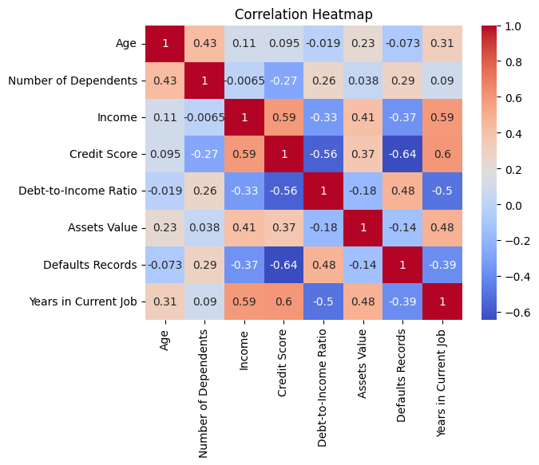
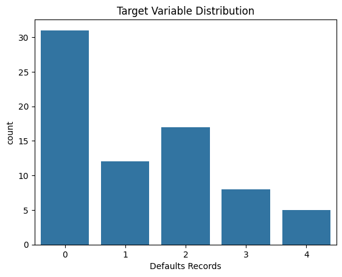
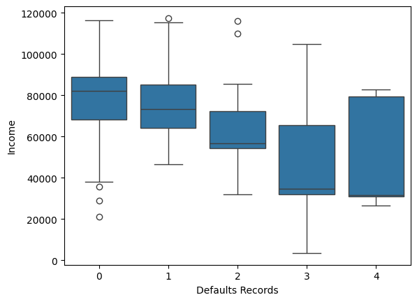

```python
import pandas as pd

file_path = r"C:\Users\User\Downloads\Anaconda\Risk Behavior Features Analysis\risk_behavior_features.csv"
df = pd.read_csv(file_path)

# Basic inspection
print(df.shape)
print(df.info())
print(df.head())

```

    (73, 12)
    <class 'pandas.core.frame.DataFrame'>
    RangeIndex: 73 entries, 0 to 72
    Data columns (total 12 columns):
     #   Column                Non-Null Count  Dtype  
    ---  ------                --------------  -----  
     0   Age                   73 non-null     int64  
     1   Gender                73 non-null     object 
     2   Education Level       73 non-null     object 
     3   Marital Status        73 non-null     object 
     4   Number of Dependents  73 non-null     int64  
     5   Income                73 non-null     int64  
     6   Credit Score          73 non-null     int64  
     7   Debt-to-Income Ratio  73 non-null     float64
     8   Assets Value          73 non-null     int64  
     9   Defaults Records      73 non-null     int64  
     10  Employment Status     73 non-null     object 
     11  Years in Current Job  73 non-null     int64  
    dtypes: float64(1), int64(7), object(4)
    memory usage: 7.0+ KB
    None
       Age      Gender Education Level Marital Status  Number of Dependents  \
    0   36      Female      Bachelor's       Divorced                     2   
    1   37  Non-binary        Master's         Single                     3   
    2   45        Male      Bachelor's       Divorced                     1   
    3   39        Male        Master's         Single                     0   
    4   40      Female        Master's        Married                     1   
    
       Income  Credit Score  Debt-to-Income Ratio  Assets Value  Defaults Records  \
    0   56789           715                  0.25        158765                 2   
    1   91234           789                  0.18        176543                 0   
    2   65432           723                  0.25        134567                 1   
    3   92345           801                  0.15        192345                 0   
    4   76543           756                  0.22        162345                 0   
    
      Employment Status  Years in Current Job  
    0          Employed                     6  
    1          Employed                    10  
    2          Employed                     6  
    3          Employed                    10  
    4          Employed                     8  
    


```python
import seaborn as sns
import matplotlib.pyplot as plt

# Correlation heatmap for numeric features
sns.heatmap(df.corr(numeric_only=True), annot=True, cmap='coolwarm')
plt.title('Correlation Heatmap')
plt.show()

# Distribution of Default Records
sns.countplot(x='Defaults Records', data=df)
plt.title("Target Variable Distribution")
plt.show()

# Boxplot: Income vs. Defaults Records
sns.boxplot(x='Defaults Records', y='Income', data=df)
plt.show()

```


    

    


    

    


    

    


```python
# Convert categorical features
cat_cols = ['Gender', 'Education Level', 'Marital Status', 'Employment Status', 'Years in Current Job']
df_encoded = pd.get_dummies(df, columns=cat_cols, drop_first=True)

# Binary classification target
df_encoded['Default_Binary'] = df_encoded['Defaults Records'].apply(lambda x: 1 if x >= 1 else 0)

# Drop multi-class target 
X = df_encoded.drop(columns=['Defaults Records', 'Credit Score']) 
y = df_encoded['Default_Binary']

```


```python
from sklearn.model_selection import train_test_split
from sklearn.preprocessing import StandardScaler

X_train, X_test, y_train, y_test = train_test_split(X, y, test_size=0.2, random_state=42)

scaler = StandardScaler()
X_train_scaled = scaler.fit_transform(X_train)
X_test_scaled = scaler.transform(X_test)

```


```python
from sklearn.linear_model import LogisticRegression
from sklearn.metrics import classification_report, confusion_matrix

lr = LogisticRegression()
lr.fit(X_train_scaled, y_train)
y_pred_lr = lr.predict(X_test_scaled)

print("Logistic Regression Results:")
print(classification_report(y_test, y_pred_lr))
print(confusion_matrix(y_test, y_pred_lr))

```

    Logistic Regression Results:
                  precision    recall  f1-score   support
    
               0       1.00      1.00      1.00         6
               1       1.00      1.00      1.00         9
    
        accuracy                           1.00        15
       macro avg       1.00      1.00      1.00        15
    weighted avg       1.00      1.00      1.00        15
    
    [[6 0]
     [0 9]]
    


```python
from xgboost import XGBClassifier

xgb = XGBClassifier(eval_metric='logloss', random_state=42)
xgb.fit(X_train, y_train)
y_pred_xgb = xgb.predict(X_test)

from sklearn.metrics import classification_report, confusion_matrix
print("XGBoost Results:")
print(classification_report(y_test, y_pred_xgb))
print(confusion_matrix(y_test, y_pred_xgb))

```

    XGBoost Results:
                  precision    recall  f1-score   support
    
               0       1.00      1.00      1.00         6
               1       1.00      1.00      1.00         9
    
        accuracy                           1.00        15
       macro avg       1.00      1.00      1.00        15
    weighted avg       1.00      1.00      1.00        15
    
    [[6 0]
     [0 9]]
    


```python
from sklearn.ensemble import RandomForestRegressor
from sklearn.metrics import mean_squared_error, r2_score

# Keep Credit Score as target
y_score = df_encoded['Credit Score']
X_score = df_encoded.drop(columns=['Defaults Records', 'Default_Binary', 'Credit Score'])

X_train_s, X_test_s, y_train_s, y_test_s = train_test_split(X_score, y_score, test_size=0.2, random_state=42)
rf_reg = RandomForestRegressor()
rf_reg.fit(X_train_s, y_train_s)
y_pred_score = rf_reg.predict(X_test_s)

print("RMSE:", mean_squared_error(y_test_s, y_pred_score, squared=False))
print("R2 Score:", r2_score(y_test_s, y_pred_score))

```

    RMSE: 46.74507703134809
    R2 Score: 0.4764210107623529
    
